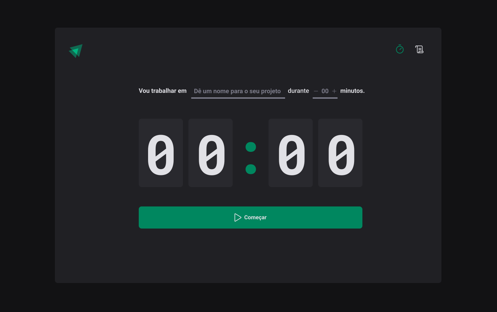
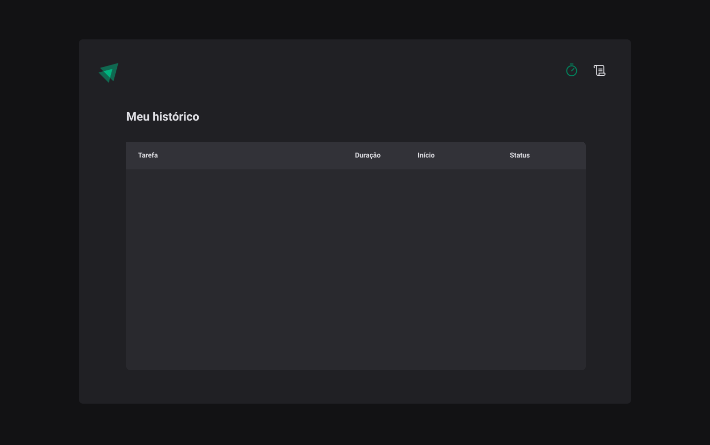

# Focus Timer project

  <a href="#tecnologias">Technologies</a>&nbsp;&nbsp;&nbsp;|&nbsp;&nbsp;&nbsp;
  <a href="#projeto">Projects</a>&nbsp;&nbsp;&nbsp;|&nbsp;&nbsp;&nbsp;
  <a href="#memo-licença">Lincense</a>

## 🚀 Technologies

This project was developed with the following technologies:

- JavaScript
- TypeScript
- React
- Context API
- Router
- Styled Component
- Html
- Css

## 💻 Project

This project was built to support the study of how to develop applications in react and its features. Applying advanced concepts of reducer, Router, Styled Component, Immer React, CRUD

## How to use?

1. Download this repository and with your terminal, enter the directory

2. Run `npm install OR yarn` to install the dependencies

3. And to start the application, run the command `npm start OR yarn start`

##

# Project vision

## Home page

 
 
 
 

## History page

Made by Pedro Henrique Lima

